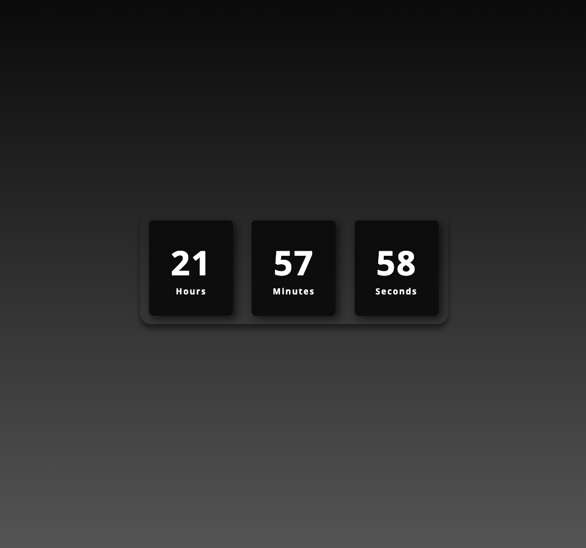

# Relógio Digital Dinâmico / Dynamic digital watch

## Índice / Index

- <a href="#Sobre">Sobre o Projeto / About the Project</a>

- <a href="Tecnologias">Tecnologias utilizadas / Used Technologies </a>

- <a href="imagens">Capturas de Tela / ScreenShot</a>

## Sobre o Projeto / About the Project

- Criação de um relógio digital que acompanha a hora em tempo real.

- Creation of a digital clock that tracks the time in real time.

## Tecnologias utilizadas / Used Technologies

- 

- 

- 

## Capturas de Tela / Screenshot

